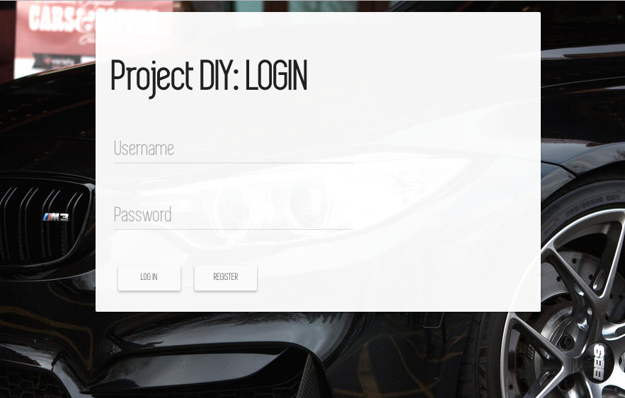
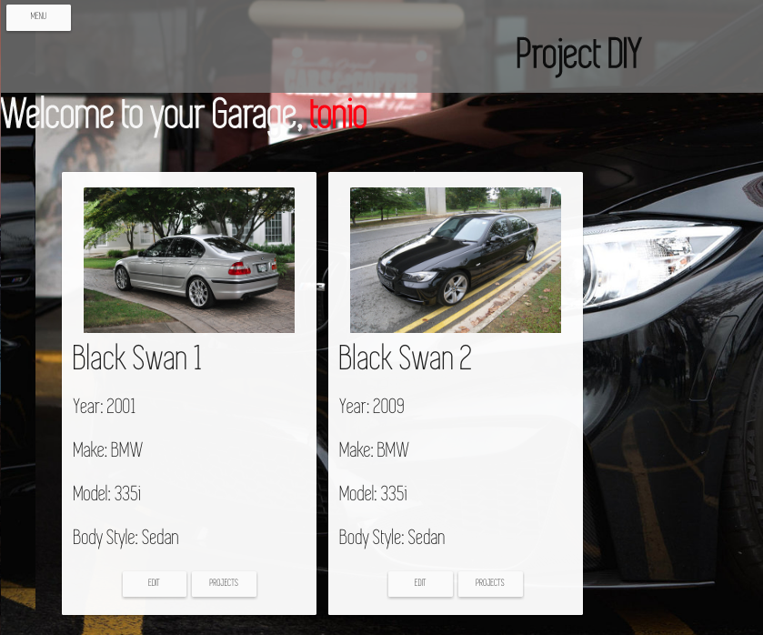
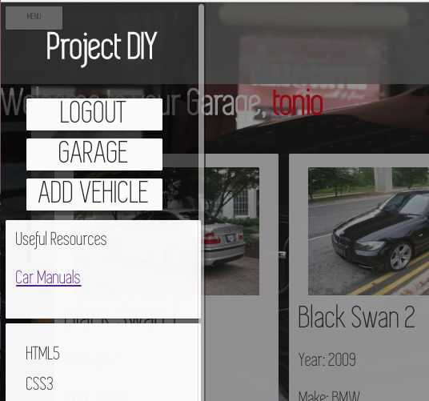
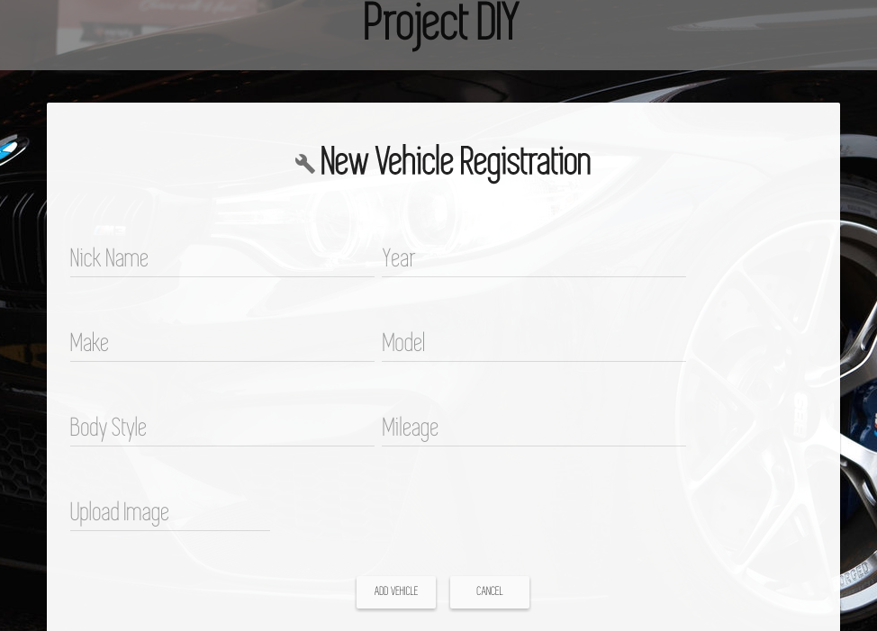
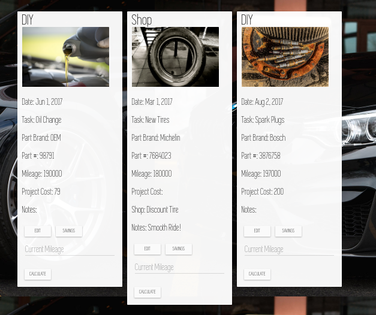
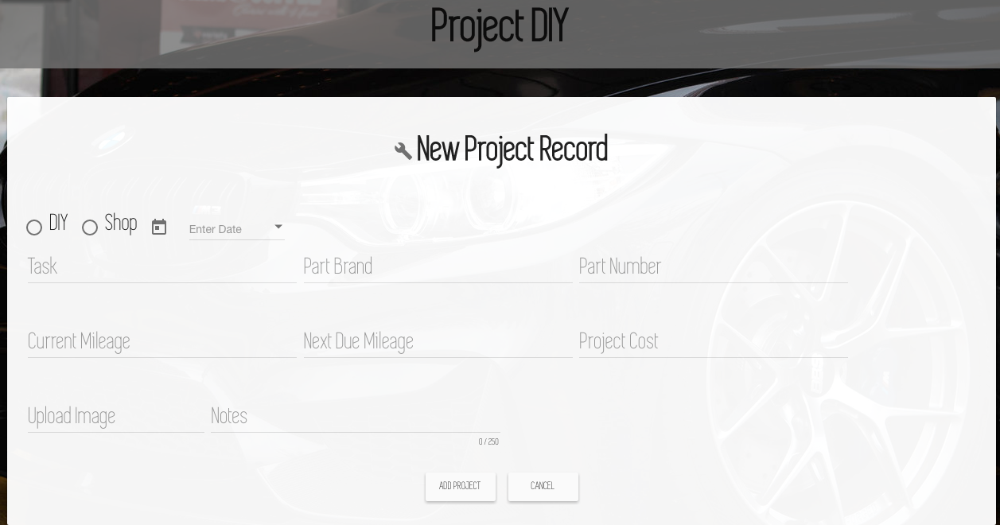

# Name of Project
Project DIY

Project DIY is a full stack web application that logs the user's Vehicle DIY projects.
The users have the ability to add vehicles to their homepage, which acts a garage.
Then they can track each vehicle's DIY or Shop services. They can also record
savings, mileage, and check if services are due.

Heroku Link:

https://projectdiy.herokuapp.com

## Built With

- MongoDB
- Mongoose
- Express
- AngularJS
- Node.js
- Filestack
- Sweet Alerts
- Angular Material

## Getting Started

These instructions will get you a copy of the project up and running on your local machine for development and testing purposes. See deployment for notes on how to deploy the project on a live system.

- Fork the repository over to your Github.
- Clone the repository and save it to your desired folder
run `npm install`

### Prerequisites

This is a MEAN - Stack web application. MongoDB, Express, AngularJS, and Node.js are all required
to run this application.

- [MongoDB](https://www.mongodb.com/)
- [AngularJS](https://angularjs.org/)
- [Express](https://expressjs.com/)
- [Node.js](https://nodejs.org/en/)
- [Angular Material](https://material.angularjs.org/latest/)

### Installing

`npm install`

## Screen Shot

 
 
 
 
 
 

## Documentation

[Google Documentation Link](https://docs.google.com/document/d/19Qik4gpgihzM-OvwkqSkSr-2oSK5A4s0VAjW-kyix5o/edit?usp=sharing)

## Authors

* Antonio Rice
